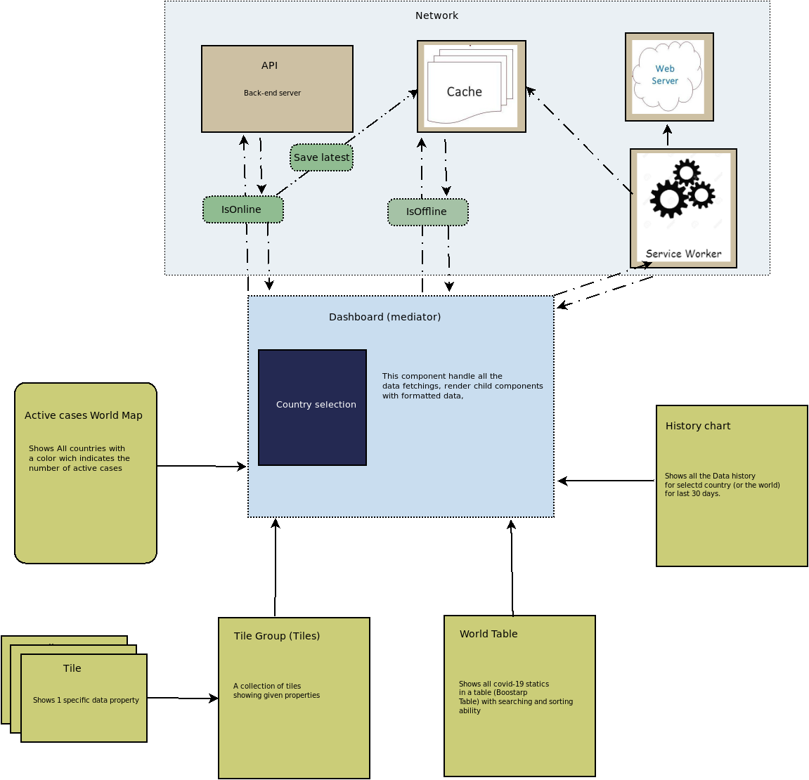

# Corona (Covid-19) Tracker

This is an open-source React based (TypeScript) project designed for tracking the current status of the coronavirus. This application loadded in offline mode also.This is showing last updated data if the device is in offline. The corona tracker is using the [Open Disease Data](https://corona.lmao.ninja/). Please build the application and run with a http server for getting the full advantages (working with offline mode).

## Live demo

See the up-to-date demo [here](https://canvas-joy-286604.el.r.appspot.com).

## Architecture diagram

## Available Scripts

In the project directory, you can run:

### `yarn start`

Runs the app in the development mode.  Open [http://localhost:3000](http://localhost:3000) to view it in the browser.

The page will reload if you make edits.  You will also see any lint errors in the console.

### `yarn test`

Launches the test runner in the interactive watch mode.  See the section about [running tests](https://facebook.github.io/create-react-app/docs/running-tests) for more information.

### `yarn build`

Builds the app for production to the `build` folder.  It correctly bundles React in production mode and optimizes the build for the best performance.

The build is minified and the filenames include the hashes.  Your app is ready to be deployed!

See the section about [deployment](https://facebook.github.io/create-react-app/docs/deployment) for more information.

## License

[Apache 2.0](https://www.apache.org/licenses/LICENSE-2.0)
